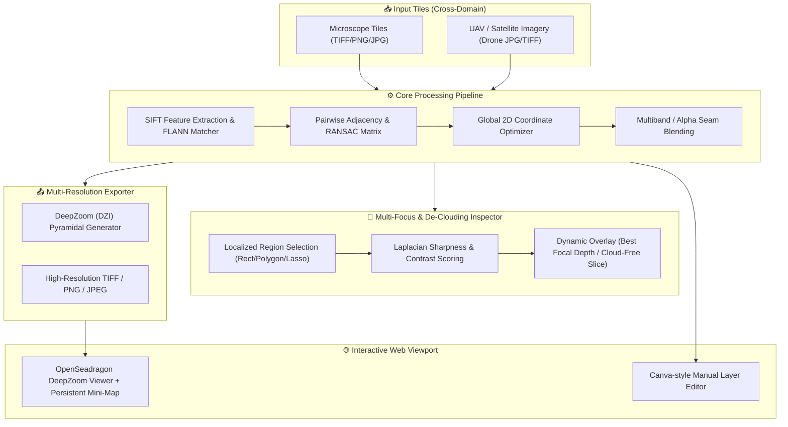

<div align="center">

# 🌐 OmniStitch Studio
### Cross-Domain Gigapixel Image Stitching & Multi-Focus / De-Clouding Clarity Inspector
**Empowering Biomedical Microscopy (WSI) & Geospatial Remote Sensing (UAV / Satellite)**

[](https://opensource.org/licenses/MIT)
[](https://www.python.org/)
[](https://github.com/Phatjhhoq8/omnistitch-studio/actions)
[](https://github.com/ellerbrock/open-source-badges/)
[](CONTRIBUTING.md)

*An end-to-end open-source scientific image stitching studio for gigapixel mosaics, featuring robust 2D SIFT global alignment, DeepZoom (DZI) interactive pyramids, Canva-style manual adjustments, and localized patch clarity inspection.*

</div>

---

## 🎯 Dual-Domain Versatility

**OmniStitch Studio** bridges the gap between high-precision **Biomedical Microscopy** and large-scale **Geospatial Remote Sensing** using a unified mathematical framework for dense 2D planar image registration:

```
                    ┌────────────────────────────────────────────────────────┐
                    │                  OmniStitch Studio                     │
                    │      (SIFT + Global Homography + DZI Pyramids)         │
                    └───────────────────────────┬────────────────────────────┘
                                                │
                 ┌──────────────────────────────┴──────────────────────────────┐
                 ▼                                                             ▼
     🔬 Biomedical Microscopy                                      🛰️ Geospatial Remote Sensing
  • Whole Slide Imaging (WSI Pathology)                         • UAV / Drone Orthomosaic Mapping
  • Multi-focal Z-stack focus stacking                         • Multi-temporal satellite de-clouding
  • Cellular tissue boundary seamless blending                  • Large terrain mosaic exploration (GIS-ready)
```

1. **🔬 Whole Slide Imaging (Digital Pathology)**:
   - Eliminates cumulative drift across dense 2D microscope scan grids (4X, 10X, 40X).
   - Localized **Clarity Inspector** evaluates Laplacian variance to automatically pick the sharpest cell layer across multiple focal depths.
   - Invisible Alpha brush eliminates air bubbles, dust, and histological staining artifacts.

2. **🛰️ Aerial & Remote Sensing (UAV / Drone / Satellite)**:
   - Stitches overlapping drone survey flights (lawnmower flight plans) into seamless, high-resolution **orthomosaics** without costly commercial photogrammetry licenses.
   - **Cloud & Shadow Removal (De-clouding)**: In multi-temporal satellite passes (e.g., Sentinel/Landsat), users can inspect cloudy patches and instantly swap in cloud-free, high-contrast imagery captured on clear days.
   - Sub-millisecond web exploration for gigapixel geographic terrain through DeepZoom pyramids.

---

## 🌟 Key Features

- **📐 Multi-Scale SIFT & Global Homography**: Robust feature detection with RANSAC outlier filtering, pairwise spatial adjacency validation, and global affine optimization.
- **🔍 DeepZoom (DZI) Pyramidal Generation**: Real-time export to multi-resolution image pyramids compatible with OpenSeadragon for smooth, sub-millisecond zooming into gigapixel slides and aerial maps.
- **✨ Localized Clarity Inspector**: Quantifies localized sharpness via variance of Laplacian across all overlapping slices. Allows researchers to click and replace blurry or cloudy areas with the sharpest captured slice.
- **🎨 Interactive Canva-Style Canvas & Invisible Masking**: Intuitive manual transform controls (pan, zoom, rotate, layer opacity) plus an invisible brush (Alpha = 0 masking) to erase unwanted artifacts.
- **⚡ Memory-Budgeted Architecture**: Chunked tile processing and premultiplied alpha downsampling designed to run smoothly on standard workstations with 8GB–16GB RAM.
- **🧪 100% Covered with Automated Unit Tests**: Includes 48 comprehensive unit tests covering coordinate contracts, security boundaries, DZI publication, and alpha compositing.

---

## 🏗️ System Architecture



---

## 🚀 Quickstart

### Option 1: Direct Python Run (Recommended)

```bash
# 1. Clone the repository
git clone https://github.com/Phatjhhoq8/omnistitch-studio.git
cd omnistitch-studio

# 2. Set up virtual environment
python -m venv .venv
source .venv/bin/activate   # Linux / macOS
# On Windows: .venv\Scripts\activate

# 3. Install lightweight dependencies
pip install -r requirements.txt

# 4. Launch the studio
python server.py
```
Open your browser and navigate to **`http://localhost:5000`**.

### Option 2: Docker Compose

```bash
docker compose up --build
```
Access the web studio at **`http://localhost:5000`**.

---

## 🧪 Testing with Sample Dataset

The repository comes bundled with a synthetic 2x2 slide dataset (`sample_data/demo_slide/`) containing simulated cell clusters and overlapping scan borders.

1. In the Web Studio left panel, select or drag-and-drop `sample_data/demo_slide`.
2. Click **"Ghép Tự Động" (Auto Stitch)**.
3. Explore the high-resolution merged slide with interactive panning and deep zoom!
4. Click **"Soi Vùng Nét" (Clarity Inspector)** to select regions and compare sharpness scores across candidates.

---

## 🧪 Running Automated Tests

Run the full suite of 48 unit tests:

```bash
python -m unittest discover -s tests
```

Output:
```text
Ran 48 tests in 2.62s
OK
```

---

## 📡 REST API Reference

| Endpoint | Method | Description |
| :--- | :---: | :--- |
| `/api/scan_folder` | `POST` | Scans a folder path for microscope tile or aerial photo candidates. |
| `/api/stitch/auto` | `POST` | Triggers background SIFT stitching and DZI pyramid generation. |
| `/api/stitch/status` | `GET` | Returns real-time stitching progress percentage and logs. |
| `/api/projects/{id}/inspect` | `POST` | Evaluates sharpness and coverage of candidate patches at a specified world polygon. |
| `/api/projects/{id}/exports` | `POST` | Exports current alignment to BigTIFF, DZI, or high-res PNG. |
| `/api/health` | `GET` | Service liveness and memory health check. |

---

## 🤝 Contributing & Community

Contributions, issues, and feature requests are welcome!
Please check our community guidelines and policies:
- 📖 [Contributing Guide](CONTRIBUTING.md)
- 🤝 [Code of Conduct](CODE_OF_CONDUCT.md)
- 🛡️ [Security Policy](SECURITY.md)
- 🔒 [Privacy Policy](PRIVACY.md)
- ⚖️ [Project Governance](GOVERNANCE.md)
- 💬 [Support Guide](SUPPORT.md)

---

## 📄 License

This project is licensed under the **MIT License** - see the [LICENSE](LICENSE) file for details.
Researchers and software developers are free to use, modify, and distribute this software for academic, clinical, and commercial applications.
