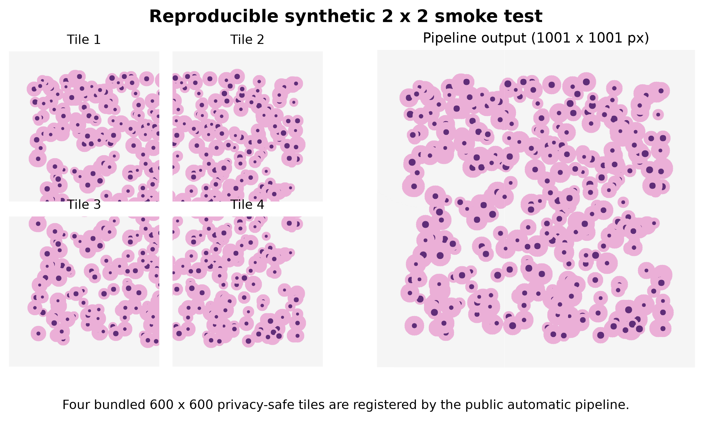
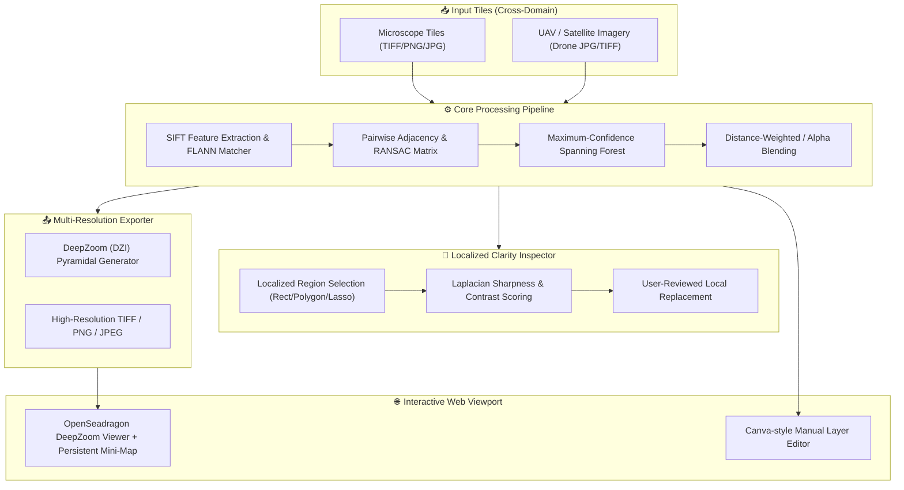

<div align="center">

# 🌐 OmniStitch Studio
### Planar Image Stitching & Localized Clarity Inspection
**An editable local workflow for microscopy and other planar tile sets**

[](https://opensource.org/licenses/MIT)
[](https://www.python.org/)
[](https://github.com/Phatjhhoq8/omnistitch-studio/actions)
[](https://github.com/ellerbrock/open-source-badges/)
[](CONTRIBUTING.md)

*An open-source image stitching studio with automatic planar registration, persistent manual adjustments, localized patch inspection, and DeepZoom (DZI) export.*

<br>

<p align="center">
  
  <br>
  <em>Privacy-safe synthetic tiles and the output generated by the automatic pipeline.</em>
</p>

</div>

---

## 🎯 Workflow Scope

**OmniStitch Studio** targets approximately planar image sets such as microscope-stage scans. It can also load other overlapping planar images, but it does not implement photogrammetric reconstruction, georeferencing, orthorectification, semantic cloud detection, or clinical image-quality assessment.

The Clarity Inspector ranks co-registered candidates by an alpha-weighted variance of the grayscale Laplacian. The score is a texture sharpness cue, not an automatic biological-quality or cloud-free classification. Users review candidates before applying a local replacement.

---

## 🌟 Key Features

- **📐 Planar Registration**: SIFT, AKAZE, or ORB features; robust pair estimation; and maximum-confidence spanning-forest placement.
- **🔍 DeepZoom (DZI) Generation**: Multi-resolution image pyramids compatible with OpenSeadragon.
- **✨ Localized Clarity Inspector**: Quantifies localized sharpness via variance of Laplacian across all overlapping slices. Allows researchers to click and replace blurry or cloudy areas with the sharpest captured slice.
- **🎨 Interactive Canva-Style Canvas & Invisible Masking**: Intuitive manual transform controls (pan, zoom, rotate, layer opacity) plus an invisible brush (Alpha = 0 masking) to erase unwanted artifacts.
- **⚡ Tiled Manual TIFF Export**: Bounded spatial rendering and memory-mapped intermediates for the manual TIFF/BigTIFF path. Automatic compositing remains full canvas.
- **🧪 Automated Verification**: Includes 53 test methods covering descriptor matching, registration ground truth, spanning-forest construction, coordinate contracts, project state, security boundaries, DZI publication, and alpha compositing.

---

## 🏗️ System Architecture



---

## 🚀 Quickstart

### Option 1: Direct Python Run (Recommended)

```bash
# 1. Clone the repository
git clone https://github.com/Phatjhhoq8/omnistitch-studio.git
cd omnistitch-studio

# 2. Set up virtual environment
python -m venv .venv
source .venv/bin/activate   # Linux / macOS
# On Windows: .venv\Scripts\activate

# 3. Install the application and dependencies
python -m pip install -e .

# 4. Launch the studio
omnistitch-studio
```
Open your browser and navigate to **`http://localhost:5000`**.

### Option 2: Docker Compose

```bash
docker compose up --build
```
Access the web studio at **`http://localhost:5000`**.

---

## 🧪 Testing with Sample Dataset

The repository comes bundled with a synthetic 2x2 slide dataset (`sample_data/demo_slide/`) containing simulated cell clusters and overlapping scan borders.

1. In the Web Studio left panel, select or drag-and-drop `sample_data/demo_slide`.
2. Click **"Ghép Tự Động" (Auto Stitch)**.
3. Explore the high-resolution merged slide with interactive panning and deep zoom!
4. Click **"Soi Vùng Nét" (Clarity Inspector)** to select regions and compare sharpness scores across candidates.

---

## 🧪 Running Automated Tests

Run the full suite of 53 unit tests:

```bash
python -m unittest discover -s tests
```

Output:
```text
Ran 53 tests
OK
```

---

## 📡 REST API Reference

| Endpoint | Method | Description |
| :--- | :---: | :--- |
| `/api/scan_folder` | `POST` | Scans a folder path for microscope tile or aerial photo candidates. |
| `/api/stitch/auto` | `POST` | Triggers background SIFT stitching and DZI pyramid generation. |
| `/api/stitch/status` | `GET` | Returns real-time stitching progress percentage and logs. |
| `/api/projects/{id}/inspect` | `POST` | Evaluates sharpness and coverage of candidate patches at a specified world polygon. |
| `/api/projects/{id}/exports` | `POST` | Exports current alignment to BigTIFF, DZI, or high-res PNG. |
| `/api/health` | `GET` | Service liveness and memory health check. |

Request and response examples are documented in [`docs/API.md`](docs/API.md).

---

## 👤 Author & Maintainer

- **Tien-Phat Nguyen** (HalogenBr, [@Phatjhhoq8](https://github.com/Phatjhhoq8))
  - Sole Creator, Lead Architect & Primary Maintainer
  - Algorithmic Pipeline, Multi-Focus Clarity Inspector & Pyramidal DeepZoom Engine

---

## 📚 Citation

If you use **OmniStitch Studio** in research, please cite:

```bibtex
@software{nguyen_omnistitch_studio_2026,
  author       = {Nguyen, Tien-Phat},
  title        = {OmniStitch Studio: Interactive Planar Image Registration and Localized Clarity Inspection},
  year         = {2026},
  publisher    = {GitHub},
  version      = {1.0.0},
  url          = {https://github.com/Phatjhhoq8/omnistitch-studio}
}
```

---

## 🤝 Contributing & Community

Contributions, issues, and feature requests are welcome!
Please check our community guidelines and policies:
- 📖 [Contributing Guide](CONTRIBUTING.md)
- 🤝 [Code of Conduct](CODE_OF_CONDUCT.md)
- 🛡️ [Security Policy](SECURITY.md)
- 🔒 [Privacy Policy](PRIVACY.md)
- ⚖️ [Project Governance](GOVERNANCE.md)
- 💬 [Support Guide](SUPPORT.md)
- 🧾 [Research-use evidence](docs/RESEARCH_USE.md)
- 📋 [Changelog](CHANGELOG.md)

---

## 📄 License

This project is licensed under the **MIT License** - see the [LICENSE](LICENSE) file for details.
Copyright (c) 2026 **Tien-Phat Nguyen (HalogenBr)**.
Researchers and developers may use, modify, and distribute this software under the MIT License. The software is not validated as a medical device or diagnostic system.
